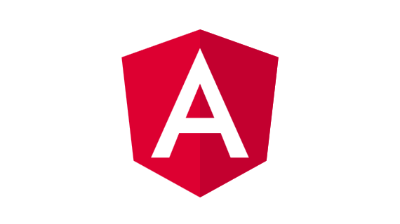

### Hello World 🌍 I'm [TOURE SOULEYMANE!](https://github.com/toure5013) 👋

<a href="mailto:toure5013@gmail.com">
   📧 toure5013@gmail.com
</a> 

 
 

I am Fullstack Blockchain , Web, mobile, rest api and Chatbot, Enthusiast Developer from Ivory Coast 🇨🇮

- 👨‍💻 I worked on many project : 
- Web
- Mobiles
- Chatbots
- Apis
- dApps
- DeFi

- 🥇 I participate on many Hackathon
- Naija Hacks
- Open Hacks
- Standford Hacks
- AgriHack
- Concour Genie
- Afrikhaton

<!--  -->

[

 

**Languages and Tools:**

<code></code>
<code></code>
<code></code>
<code></code>
<code></code>

<code></code>
<code></code>
<code></code>
<code></code>
<code></code>
<code></code>
<code></code>
<code></code>
<code></code>
<code></code>
<code></code>
<code></code>
<code></code>
<code></code>
<code></code>
<code></code>
<code></code>

 

*NOTE: Top languages does not indicate my skill level or something like that, it's a github metric of which languages i have the most code on github, it's a new feature of [github-readme-stats](https://github.com/toure5013/github-readme-stats)*

 

